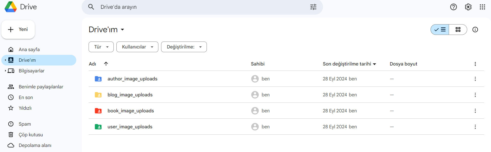
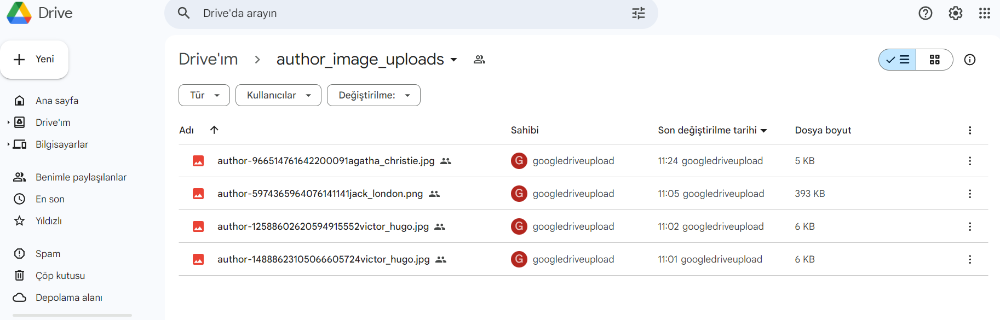
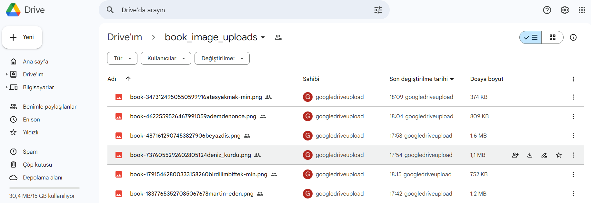

# BookWave API Overview

## Technologies Used
- **Spring Security**: For securing the application.
- **Spring Data JPA**: For database interaction.
- **Validation**: To ensure proper input handling and data validation.
- **OpenAPI**: For API documentation and interaction.
- **JWT Security**: For secure user authentication and authorization using JWT tokens.
- **PostgreSQL**: As the relational database for data storage.
- **Lombok**: To simplify code with annotations.
- **Google Drive API**: For uploading and managing images on Google Drive.
- **ModelMapper**: For mapping between DTOs and entities.
- **Mail Sender**: For sending emails.

## Image Upload Structure
The images in the project are organized into four different folders:
- `user_image_uploads`: For user profile images.
- `author_image_uploads`: For author-related images.
- `blog_image_uploads`: For blog post images.
- `book_image_uploads`: For book-related images.

Each of these folders is linked with Google Drive, and images are stored and retrieved from the corresponding Google Drive directories.

## Images

